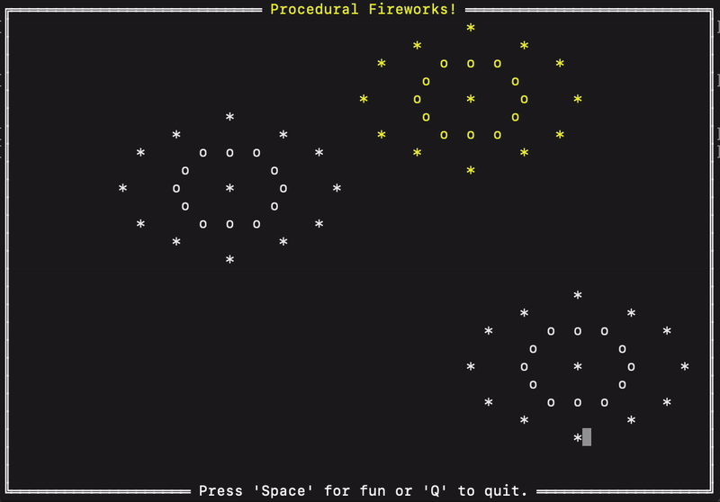

# Commandline Procedural Fireworks Animation
**Hemi Shah, Rhea John, Margo Burbank, Brian Cassriel, David Giani**

#### CPSC 370 Final Project

---

This program was created in 2 days by a team of 5 students for the final project of CPSC 370 - Agile Development.
It procedurally generates a fireworks display in the console.
The fireworks are launched at random intervals and explode into particles that sparkle in a circular pattern. 
The user can also launch more fireworks by pressing the spacebar.



The purpose of the project was to practice Scrum and Test-Driven Development by creating some sort of console app.
We decided to create something fun and visually appealing.

---

## Usage

**Running the Program**
```
dotnet run <useColor>
```
- **useColor**: true or false, determines if color is used in the simulation. Defaults to true if unspecified.

**Hotkeys**
- **Space**: Launches a firework!
- **Q**: Quits the program

---

**Dependencies**  
ConsoleRender: (https://github.com/NinovanderMark/ConsoleRenderer/tree/main)
